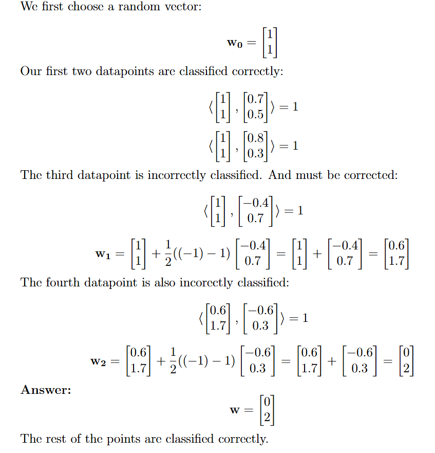
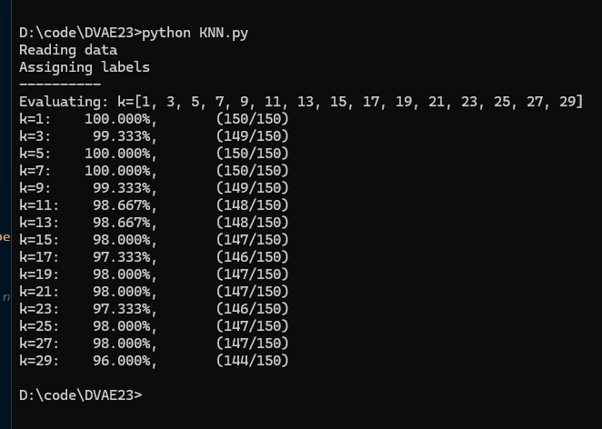
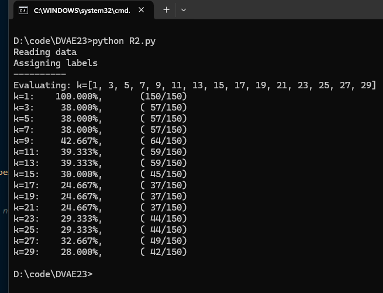

## Assignment 1

### Q1

Like we discussed in class, we could break an n-classification problem into a binary one where we compare one classifier against the rest, and then recursively this algorithn up to n-1 times, at each step reducing the hypothesis space, by 1 or n-1 labels. And when the hypothesis space only includes one label, or after n-1 recursive steps, we are done.

### Q2

The conditions are satisfied since D is linearly seperable, all distances are non zero, and the triangle criteria holds up.

### Q3

Given two sequences of length n, they can differ by [0,n] bases, preventing negative distances. Symmetry is also valid since it doesn't matter which sequence you look at first. Each sequence is also unique ensuring the identity criteria. The triangle criteria is also fulfilled since since the number of steps from one sequence to any other will allways be in [1,n].

### Q4

**A)**

The KNN algorithm was evaluated in python for all odd K's < 30. [Source Code](./assign1/KNN.py).

**B)**

I chose to use the row and column densities of 1's and 0's due to the classifiers being 0, 1 and 8. Each being relativly unique in where they are 'fat' and 'thin'. [Source Code](./assign1/R2.py)

